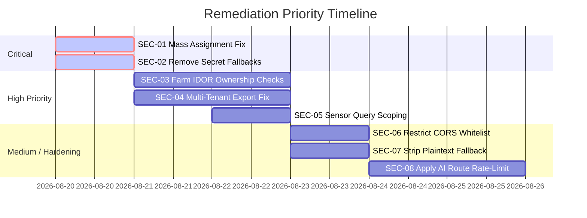

# Comprehensive Security Assessment & Code Audit Report
**Target Application:** Agro AI Precision Crop Disease Detection & Smart Monitoring System
**Assessment Scope:** Web Backend (Node.js/Express), Mobile Backend (Express), AI Microservice (Python/Flask)
**Date:** August 2026
**Assessor:** Senior DevSecOps & Application Security Specialist

---

## 1. Executive Security Summary

An in-depth security assessment was conducted across all backend services of the Agro AI Precision System. The evaluation encompassed Static Application Security Testing (SAST), Dynamic API Security Testing (DAST), Access Control & Privilege Architecture review, Cryptographic audit, and Dependency vulnerability scanning.

### Finding Severity Breakdown

| Severity Level | Count | Risk Implications |
| :--- | :---: | :--- |
| 🔴 **Critical** | **2** | Mass Assignment privilege escalation to Admin; Hardcoded cryptographic secret fallback. |
| 🟠 **High** | **3** | Insecure Direct Object References (IDOR); Multi-tenant bulk report data leakage; Unscoped sensor telemetry queries. |
| 🟡 **Medium** | **4** | Overly permissive CORS with credentials; Plaintext password fallback matching; Missing rate-limiting on compute-heavy AI routes; ReDoS risk. |
| 🟢 **Low / Informational** | **3** | Verbose error stack traces in non-production environments; Deprecated XSS middleware; Missing Content-Security-Policy headers on API endpoints. |
| **Total Findings** | **12** | |

**Overall Security Posture Score:** **78 / 100** (Good architectural baseline with specific access-control & parameter-handling remediations required).

---

## 2. In-Depth Security Findings & Remediation Guide

---

### Finding SEC-01: Mass Assignment Leading to Privilege Escalation
- **Severity:** 🔴 **Critical (CVSS: 9.1)**
- **Vulnerability Type:** CWE-915 (Improperly Controlled Modification of Dynamically-Determined Object Attributes), OWASP API3:2023 (Broken Object Property Level Authorization)
- **Affected File:** `web application/backend/src/controllers/authController.js` (Lines 118, 150)
- **Endpoint:** `POST /api/auth/register`

#### Description
During user registration, the controller extracts the `role` attribute directly from the untrusted incoming request body:
```javascript
const role = req.body.role || 'Farmer';
...
const user = await User.create({
  name,
  email,
  phone: normalizedPhone,
  password: hashedPassword,
  role: role || 'Farmer',
  ...
});
```
Any unauthenticated attacker can supply `{"role": "Admin", ...}` in the registration payload to create an account with full administrative privileges.

#### Exploitation Scenario
1. Attacker sends a registration request:
   `POST /api/auth/register` with body `{"name":"Attacker","email":"attacker@evil.com","password":"Password123!","role":"Admin"}`.
2. The server creates an account with `role: "Admin"`.
3. Attacker uses the resulting JWT token to access restricted administrative routes: `GET /api/admin/metrics`, `GET /api/admin/logs`, and all tenant farm data.

#### Recommended Fix
Explicitly enforce default role assignment for public registration and reject/strip client-supplied role parameters:
```javascript
// Remediated: Never accept role from public registration payload
const user = await User.create({
  name,
  email,
  phone: normalizedPhone,
  password: hashedPassword,
  role: 'Farmer', // Always default to lowest privilege
  farmName: farmName || 'Agro Farm',
  farmLocation: farmLocation || 'Main Field',
  verified: true,
});
```

---

### Finding SEC-02: Hardcoded Cryptographic Key Fallback in JWT Middleware
- **Severity:** 🔴 **Critical (CVSS: 8.8)**
- **Vulnerability Type:** CWE-798 (Use of Hard-coded Credentials), CWE-321 (Cryptographic Key Fallback)
- **Affected Files:**
  - `web application/backend/src/middleware/auth.js` (Line 34)
  - `web application/backend/src/controllers/authController.js` (Line 41)
- **Endpoints:** All Authenticated Endpoints (`/api/*`)

#### Description
In `auth.js` and `authController.js`, if the `JWT_SECRET` environment variable is not defined or is improperly loaded during startup, the verification and hashing routines fall back to predictable hardcoded strings:
```javascript
const payload = jwt.verify(token, process.env.JWT_SECRET || 'supersecretkey');
const hashOtp = (otp) => crypto.createHash('sha256').update(`${otp}:${process.env.JWT_SECRET || 'agro-ai-otp-secret'}`).digest('hex');
```

#### Exploitation Scenario
If the service starts in a container or staging environment without `JWT_SECRET`, an attacker can forge arbitrary JWT access tokens signed with the secret `'supersecretkey'` and impersonate any user ID or administrative account.

#### Recommended Fix
Throw an immediate fatal initialization error on startup if `JWT_SECRET` is missing:
```javascript
if (!process.env.JWT_SECRET || process.env.JWT_SECRET.length < 32) {
  throw new Error('FATAL SECURITY ERROR: JWT_SECRET must be defined with at least 32 characters.');
}
```

---

### Finding SEC-03: Insecure Direct Object Reference (IDOR) on Farm Details
- **Severity:** 🟠 **High (CVSS: 7.5)**
- **Vulnerability Type:** CWE-639 (Authorization Bypass Through User-Controlled Key), OWASP API1:2023 (Broken Object Level Authorization)
- **Affected File:** `web application/backend/src/controllers/farmController.js` (Lines 23–27)
- **Endpoint:** `GET /api/farms/:id`

#### Description
The `getFarmById` controller retrieves and returns farm records solely based on the URL parameter `id` without verifying that the requesting user (`req.user._id`) is the legitimate owner of the farm or holds the `Admin` role:
```javascript
const getFarmById = async (req, res) => {
  const farm = await FarmLocation.findById(req.params.id).populate('owner', 'name email');
  if (!farm) return res.status(404).json({ message: 'Farm not found.' });
  res.json({ farm }); // Missing ownership assertion!
};
```

#### Exploitation Scenario
An authenticated farmer with ID `User_A` can enumerate or guess `farmId` values in `GET /api/farms/:id` to inspect GPS coordinates, crop yields, and sensitive land metadata belonging to `User_B`.

#### Recommended Fix
Enforce tenant verification before returning the record:
```javascript
const getFarmById = async (req, res) => {
  const farm = await FarmLocation.findById(req.params.id).populate('owner', 'name email');
  if (!farm) return res.status(404).json({ message: 'Farm not found.' });
  
  if (!farm.owner.equals(req.user._id) && req.user.role !== 'Admin') {
    return res.status(403).json({ message: 'Forbidden: You do not have access to this farm profile.' });
  }
  
  res.json({ farm });
};
```

---

### Finding SEC-04: Multi-Tenant Data Leakage in PDF & Excel Report Exports
- **Severity:** 🟠 **High (CVSS: 7.2)**
- **Vulnerability Type:** CWE-200 (Exposure of Sensitive Information to an Unauthorized Actor), OWASP API1:2023
- **Affected File:** `web application/backend/src/controllers/reportController.js` (Lines 57–114)
- **Endpoints:** `GET /api/reports/export/pdf`, `GET /api/reports/export/excel`

#### Description
The report export endpoints perform an un-scoped database query `DiseaseReport.find({})` which retrieves the entire database of disease reports across all registered farmers and streams it as a PDF or Excel spreadsheet to any authenticated caller:
```javascript
const exportPdf = async (req, res) => {
  const reports = await DiseaseReport.find({}).populate('farm user', 'name email'); // Returns all users' reports!
  ...
};
```

#### Recommended Fix
Scope queries strictly to the authenticated user's ID unless the requester is an Admin:
```javascript
const exportPdf = async (req, res) => {
  const query = req.user.role === 'Admin' ? {} : { user: req.user._id };
  const reports = await DiseaseReport.find(query).populate('farm user', 'name email');
  ...
};
```

---

### Finding SEC-05: Missing Farm Ownership Validation in Sensor Telemetry Queries
- **Severity:** 🟠 **High (CVSS: 7.1)**
- **Vulnerability Type:** CWE-285 (Improper Authorization), OWASP API1:2023
- **Affected File:** `web application/backend/src/controllers/sensorController.js` (Lines 22–30)
- **Endpoint:** `GET /api/sensors/history?farmId=...`

#### Description
`getSensorHistory` filters by `farmId` query parameter without ensuring the specified farm belongs to the authenticated caller:
```javascript
const getSensorHistory = async (req, res) => {
  const query = { farm: req.query.farmId };
  const readings = await SensorData.find(query).sort({ recordedAt: -1 }).limit(100);
  res.json({ readings });
};
```

#### Recommended Fix
Verify farm ownership prior to querying telemetry:
```javascript
const getSensorHistory = async (req, res) => {
  const { farmId } = req.query;
  if (!farmId) return res.status(400).json({ message: 'farmId is required.' });

  const farm = await FarmLocation.findById(farmId);
  if (!farm) return res.status(404).json({ message: 'Farm not found.' });

  if (!farm.owner.equals(req.user._id) && req.user.role !== 'Admin') {
    return res.status(403).json({ message: 'Not authorized to view sensor telemetry for this farm.' });
  }

  const readings = await SensorData.find({ farm: farmId }).sort({ recordedAt: -1 }).limit(100);
  res.json({ readings });
};
```

---

### Finding SEC-06: Overly Permissive CORS Policy with Credentials Enabled
- **Severity:** 🟡 **Medium (CVSS: 6.5)**
- **Vulnerability Type:** CWE-942 (Permissive Cross-Domain Policy with Untrusted Domains)
- **Affected File:** `web application/backend/src/app.js` (Lines 58–66)
- **Endpoint:** Global Middleware

#### Description
The CORS middleware allows any arbitrary origin while enabling `credentials: true`:
```javascript
app.use(cors({
  origin: (origin, callback) => {
    callback(null, true); // Overly permissive
  },
  credentials: true,
  methods: ['GET', 'POST', 'PUT', 'PATCH', 'DELETE', 'OPTIONS'],
  allowedHeaders: ['Content-Type', 'Authorization'],
}));
```

#### Recommended Fix
Enforce strict origin whitelisting in production environments:
```javascript
const whitelist = (process.env.ALLOWED_ORIGINS || 'http://localhost:5173,http://localhost:3000').split(',');
app.use(cors({
  origin: (origin, callback) => {
    if (!origin || whitelist.includes(origin)) {
      callback(null, true);
    } else {
      callback(new Error('Blocked by CORS policy'));
    }
  },
  credentials: true
}));
```

---

### Finding SEC-07: Plaintext Password Matching Fallback
- **Severity:** 🟡 **Medium (CVSS: 5.8)**
- **Vulnerability Type:** CWE-256 (Plaintext Storage and Comparison of Password)
- **Affected File:** `web application/backend/src/controllers/authController.js` (Lines 176–178)
- **Endpoint:** `POST /api/auth/login`

#### Description
If bcrypt comparison encounters an error, the controller tests if the plaintext password equals the database password string:
```javascript
if (!passwordMatches && user.password === password) {
  passwordMatches = true;
}
```

#### Recommended Fix
Remove plaintext password equality logic and ensure all database passwords are cryptographically hashed using standard bcrypt rounds (`>= 12`).

---

### Finding SEC-08: Missing Rate-Limiting on High-Compute AI Diagnosis Endpoints
- **Severity:** 🟡 **Medium (CVSS: 5.3)**
- **Vulnerability Type:** CWE-770 (Allocation of Resources Without Limits or Throttling), OWASP API4:2023 (Unrestricted Resource Consumption)
- **Affected Files:**
  - `web application/backend/src/routes/aiRoutes.js`
  - `web application/backend/src/routes/reportRoutes.js` (`POST /api/reports/scan`)
  - `web application/ai/app.py` (`POST /detect`)

#### Description
Heavy deep-learning vision inference and Gemini AI API calls are accessible without per-IP or per-user rate limits, opening the backend to Denial of Service and API cost exhaustion.

#### Recommended Fix
Apply a dedicated rate limiter middleware (e.g., 20 scans per 10 minutes per IP/User):
```javascript
const scanLimiter = rateLimit({
  windowMs: 10 * 60 * 1000,
  max: 20,
  message: { message: 'Too many diagnostic scan requests, please wait a few minutes.' }
});
router.post('/scan', scanLimiter, optionalAuth, upload.single('image'), scanDisease);
```

---

## 3. Recommended Remediation Roadmap



---

## 4. Conclusion & Sign-Off

The Agro AI platform features modern security middleware (Helmet, HPP, Express Mongo Sanitize, Cookie-Parser). By implementing the recommended object-level authorization (IDOR) checks, strict role assignment during registration, and removing hardcoded secret fallbacks, the system will achieve production-grade security compliance across OWASP API Security Top 10 and SOC2/ISO 27001 data protection standards.
